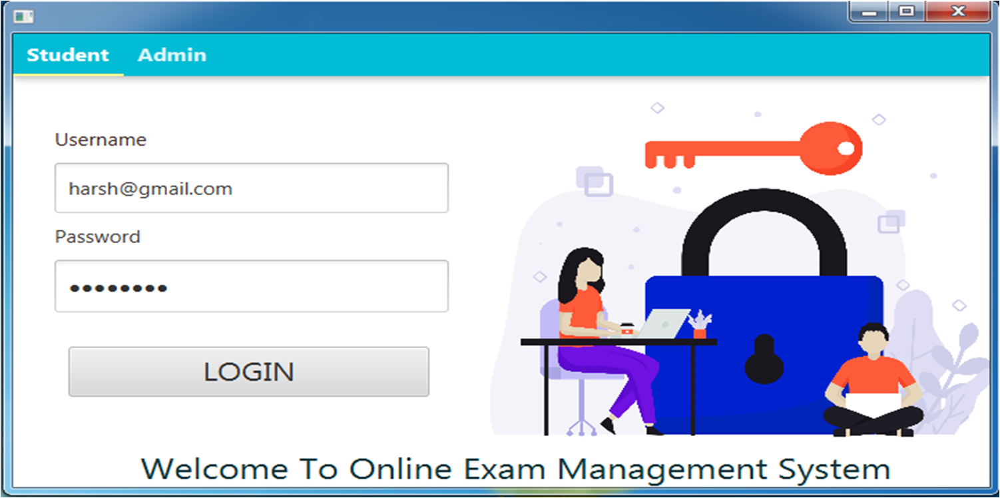
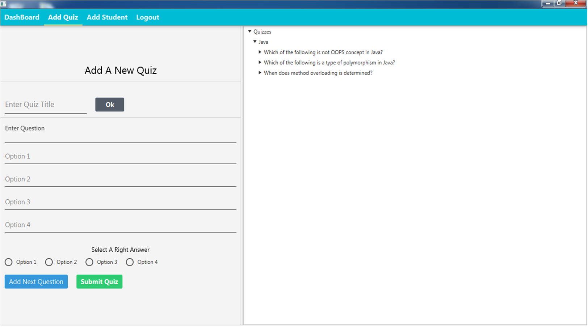
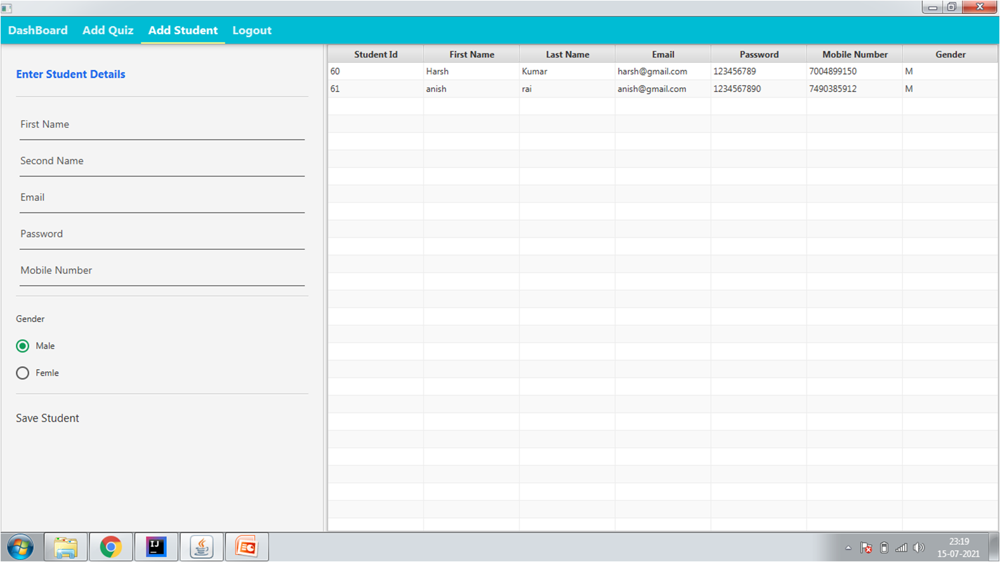
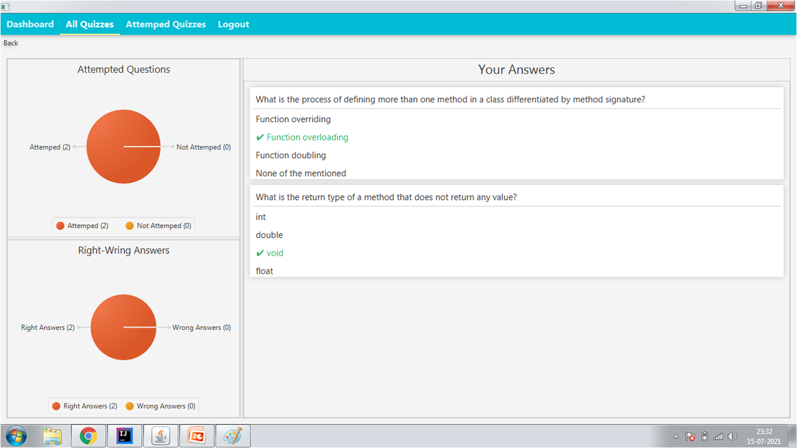

# Examination Application

#### The Exam App will permit to take and give online examination and maintaining master information and generating various reports of test. The main users of the project are Student and System Administrator.
[](https://github.com/harshmgr/Exam-App) [](https://github.com/harshmgr/Exam-App/blob/master/LICENSE/)

## Abstract


This Application will help students of Schools /Colleges to offer a quick and easy way to appear for the exam. It also
provides the results immediately after the exam. The students has to enter valid user id and password to attend the
exam. This examination project provides time limit to finish the exam. The user can see their results after completing
the exam.

[](https://github.com/harshmgr/Exam-App/blob/master/Project%20Presentation.pdf) []()

> **To download the presentation, [click here](https://github.com/harshmgr/Exam-App/blob/master/Project%20Presentation.pdf).**

> **You can check the screenshots of User Interface**





## Core Features


- It reduces the time of taking examinations of the Students manually.
- The system handles all the operations, that includes name that given exam.
- Allow students to see or display his answers after the exam is finish.
- The type of questions is only multiple choice or true and false.

## Additional Features

**Admin Dashboard** deal with the following :

- Displaying all members records.

- Displaying all Quiz records.

- Add Quiz

- Add Member/Student Records

- Delete Member/Student Records

- Update Member/Student Records.

## Modules

- Admin login
- Member login
- Add and Update Members
- Add and Remove Members
- Take Exams

## Technology Stack Used


- Front End - **JavaFx**, **CSS**
- Back End - **JAVA**
- Database - **SQLite**


```java

  if (needHelp === true) {
     String emailId = "kumarharsh8549@gmail.com";
     // email is the best way to reach out to me.
     sendEmail(emailId);
  }

```

Feel free to contact me via [Facebook](https://www.facebook.com/harsh.arya.mgr/).

Invite me to connect on [LinkedIn](https://www.linkedin.com/in/harshkumar001/).

[](https://m.facebook.com/harsh.arya.mgr) [](https://www.linkedin.com/in/harshkumar001/)

[](https://github.com/harshmgr/Examination-Application/blob/master/Project%20Presentation.pdf) []()

- [Download](https://github.com/harshmgr/Examination-Application/blob/master/Project%20Presentation.pdf)
  Presnetation
- [Download]()
  SYNOPSIS


## License

[](https://github.com/harshmgr/Examination-Application/LICENSE) [](https://github.com/harshmgr)

**GPL &copy; [HARSH KUMAR](https://github.com/harshmgr/Examination-Application/LICENSE)**

Thank you for being here!

Give Feedback on my Mail.

[](https://github.com/harshmgr)

------

```java

if(isAwesome){
        // thanks in advance :p
        starThisRepository();
        }

```

-------
